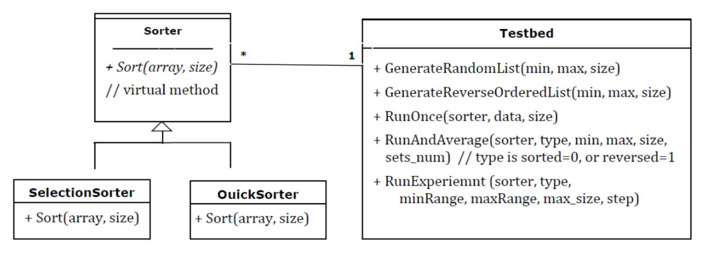

# DataStructures-Course-Assignments

# Problem 1 
## Description:
Different variations of types int and float exist in C++ and other languages. They are usually limited by minimum and maximum values. Sometimes it is desired to have versions of these types with unlimited bounds. Java solves this problem by providing BigInteger and BigDecimal classes. In this problem it is required to develop a new C++ type (class) that can hold unlimited decimal integer values and performs arithmetic operations on them. You will develop in C++ a class, BigInt that supports writing statements with extremely long integer values like these: 
<strong>
BigInt num1("123456789012345678901234567890"); 
BigInt num2("113456789011345678901134567890"); 
BigInt num3 = num2 + num1;  cout << "num1 = " << num1 << endl; 
</strong>
 
### Functions:
<ul>
<li>Design the class BigInt that has the following public interface (set of operations available
to use by developers using the class): 

<strong> BigInt (string decStr); // Initialize from string and rejects bad input 
BigInt (int decInt); // Initialize from integer 
BigInt operator+ (BigInt anotherDec); 
BigInt operator= (BigInt anotherDec);  
Int size(); 
</strong>

You will also need to overwrite the << operator as follows:  

<strong>friend ostream& operator << (ostream& out, BigInt b) </strong>

Using data encapsulation, you are free to store the digits of the big decimal integer in whatever container you like. You might store them in an array, a vector, a string or whatever. These are details that are not important to the user of your class. You will need to build + and – operations that work on the representation you chose. 

<li>Implement the class BigInt and write five test cases (including –ve numbers) to test it.
Implement a program that runs the test cases and verifies the result.
</ul>

# Problem 2 
## Description:
You will develop an application for performing calculations on fractions.

### Functions:
<ul>
<li>First, develop a class Fraction that represents a fraction by one integer divided by 
another, e.g.,1/3 or 3/7.
  <ul>
  <li>This class defines adding, subtracting, multiplying, dividing and comparing (<, >, ==, <=
  and >=) fractions by overloading the standard operators for these operations.

  <li>It should also contain a function for reducing fractions. For example 2/6 is reduced after
  calling the function to 1/3, etc

  <li>You also need to overload I/O operators to be able to input and output fractions
  naturally
  using >> and << operators.

  </ul>

<li>Separate class specifications from implementation by creating Fraction.h for specs and
Fraction.cpp for implementation.

<li>Second, develop a class FractionCalculator that utilizes the class Fraction and allows the user to input a fraction and perform calculations by adding, subtracting, etc. another fraction and then keeping the result as a fraction for further calculations.
</ul>

# Problem 3 
## Description:
   You will develop an application for matrix calculations.

### Functions:
<ul>
 <li>It is required to design and implement a generic class Matrix, in the form of a class template that accepts a type parameter. This way, when the class Matrix is instantiated, we decide if it should accept float, int or double, etc
  
 <li>Matrix class holds a matrix of any size and allocates the required memory as needed.
  
 <li>Matrix class should have a destructor that frees used memory at the end of lifetime of each Matrix objects.
  
 <li>Matrix class specifications should be in a separate header “.h” file. 
 <li>It should have a pointer-to-pointer attribute that points to the matrix content. It should 
havesuitable constructors and methods for allocating the required memory space based on 
the dimensions decided by the user.
  
 <li>Overload standard operators and I/O operators to enable Matrix class with addition, subtraction and multiplication and suitable input and output capabilities. Add a method for matrix transpose.
  
 <li>Then develop a <strong>MatrixCalculator </strong>class which offers the user a menu of operations to perform on int matrices as follows. Each of these options should be able to accept matrices of varying dimensions, which the user inputs. For multiplication, the calculator should check that two matrices are of dimensions n x m and m x p.  Welcome to (Your Name) Matrix Calculator

1- Perform Matrix Addition 
2- Perform Matrix Subtraction 
3- Perform Matrix Multiplication 
4- Matrix Transpose 
  
</ul>

# Problem 4 
## Description:
   The given function ListPermutations below prints all the permutations of a given string. It is required to modify this function so that it only prints unique strings. The current function will do exhaustive recursion to calculate all permutations. So, if the given string has duplicate characters, the output will have duplicate words. For example, if it is given the string “Makka”, it will print “Mkkaa” four times. Try this function and see how it works. 

# Problem 5 
## Description:
You will develop an application for performing operations on strings.

### Functions:
<ul>First, develop a class StudentName that represents your full name and has only a variable name of type string
<li>Your class should contain a constructor that takes a string from user. The input string should contain at least 2 spaces. If the user violates this rule, you should copy the last name many times to make the names variable a name with 2 spaces. e.g., “ahmed Mohamed sayed”➔ “ahmed Mohamed sayed”  “sara ahmed” ➔ “sara ahmed ahmed”  “Khaled” ➔ “ khled Khaled Khaled”  “aya ali ahmed sayed” ➔ “ aya ali ahmed sayed” 

<li>Add a function print that prints the detailed parts of the name each in one line. <strong>detailed parts of the name are: 
1) aya 
2) ali 
3) ahmed 
4) sayed</strong>  
<li>Add function replace(int i,int j) that replaces the name at position I with the name at position j and return true if operation is valid and false if one of the two indices is out of range.  <strong>e.g., “ahmed hassan ali” 
replace(1,2) ➔ true ➔ “Hassan ahmed ali” 
replace(3,1) ➔ true ➔ “ali Hassan ahmed” 
replace(2,4) ➔ false</strong>  
<li>Write a main function and 5 test cases with different names. For each test case you should call the replace function and the print function to check the effect of the replacement if valid.
</ul>

# Problem 6 
## Description:
   Write a program that handles an address book program, to process the following functions
   
### Functions:
<ul>
 <li>First, write a class called PhoneDirectory. Add a first name, last name and phone number entry as a private.
 <li>The main program uses a simple text-based interface to give the user access to the directory. In a while loop, the program presents the user with a menu of options:
  <ol>
   <li>Add an entry to the directory
   <li>Look up a phone number
   <li>Look up a phone number
   <li> Delete an entry from the directory
   <li>List All entries in phone directory
   <li>Exit form this program
  </ol>
 <li>Delete an entry by first name.
 <li>List the directory in alphabetical order by first name.
 <li>Use at least 3 sorting techniques for points 3 & 4, to perform time analysis on these different algorithms.
 <li>Lookup an entry by first name.
 <li>Lookup an entry by phone number.
</ul>

# Problem 7 
## Description:
If you have a list of songs in a music library and want to sort this list alphabetically. However, you want songs with the title “Untitled” to always appear at the top. Write a function called BiasedSort that accepts a vector by reference and sorts the songs according to the explained rules above.

# Problem 8 
## Description:
   Insertion sort uses linear search to find the right place for the next item to insert. Would it be faster to find the place using binary search (reduce number of comparisons)? We still must shift 1 item at a time from the largest till the right place.
Use binary search on the already sorted items to find the place where the new element
should go and then shift the exact number of items that need to be shifted and placing the
new item in its place. The algorithm works the same, except that instead comparing and
shifting item by item, it will compare quickly using binary search but it will still shift one by one till the right place (without comparison).
### Functions:
<ul>
 <li>Plot the performance of the algorithm against the original insertion sort.
</ul>

# Problem 9 
## Description:
   In this problem, we will develop classes to use for testing two sorting algorithms (Selection
and Quick sort). The class will have methods to support experimenting and analyzing sorting
algorithms performance. Below is a high-level UML diagram for your classes. Add any
missing details. Testbed class has the following functions that you should complete: 
 

### Functions:
<ul>
 <li>GenerateRandomList(min, max, size) Generate a given number of random integer data from a certain range. For example, one can generate a vector/array of 10000 integer numbers that fall in the range from 1 to 100000, e.g., [5554, 32300, 98000, 342, …]
  
 <li>GenerateReverseOrderedList(min, max, size) Generate a given number of reverse ordered integer data from a certain range. You can first generate random data and then sort them reversed
  
 <li><strong>RunOnce(sorter, data, size)</strong> Run a given sorting algorithm on a given set of data and calculate the time taken to sort the data

  
 <li><strong>RunAndAverage(sorter, type, min, max, size, sets_num)</strong> Run a given sorting algorithm on several sets of data of the same length and same attributes (from the same range and equally sorted; e.g., random or reversed) and calculate the average time. 
 
   <li><strong>RunExperient (sorter, type, min, max, min_val, max_val, sets_num, step) </strong>Develop
an experiment to run a given sorting algorithm and calculate its performance on sets
of different sizes (e.g., data of size 10000, 20000, etc.) as follows:

    <ol>
    <li>All sets are generated with values between min and max 
    <li>First, generate sets_num sets with size min_val. Use RunAndAverage () and
record average time to process the sets 
    <li>Next, repeat step ii but with sets whose size increases by step till reaching
max_val. Each time record average time to process the sets
 
   <li>For example I should be able to design an experiment to run Quick sort
algorithm on randomly sorted integers data taken from the range (1 to
1,100,000) and with input value (data size) from 0 to 100000, with step 5000.
This means we will run the algorithms on data sets of 5000, 10000, 15000, …,
100000 randomly sorted integers. Note that with each step you will generate
sets_num different sets and take the average of their runs 
    <li>The output of the experiment goes to screen as a table with two columns; first
column indicates set size, and second column indicates average time 
   </ol>
</ul>
  
Write a main() demo to show that the function works correctly and to measure the performance of Quick sort and Selection sort in cases of random data and reverse ordered data using Testbed class.

</ul>

# Problem 10 
## Description:
  In this problem, you should develop a linked list class similar to that provided in the C++ STL.
The public interface of your class should provide basic insertion and deletion functions. In
addition, it should provide an iterator class as an inner class in order to access the data stored in
the list. For example, if we have a list of three elements, and want to access the second element,
we should declare an iterator and initialize it to the position of the first element, and move to the
second position as shown in the code below: 
  

<strong>
list<int> myList; 
myList.push_back(1); 
myList.push_back(2); 
myList.push_back(3); 
list<int>::iterator it = myList.begin(); 
it++; 
cout<< *it; 
</strong>

  
  
notice the usage of the scope operator in the declaration of the iterator, this is because the
iterator class is defined as an inner class inside the list class: 
  

<strong>
template<class type> 
class myList { 
public: 
class iterator { 
// your code for the iterator class here 
}; 
// your code for the list class here 
}; 
</strong>

  
  
Your list class should be a template class. 
The list class should have the following public interface: 
 
### Functions:

